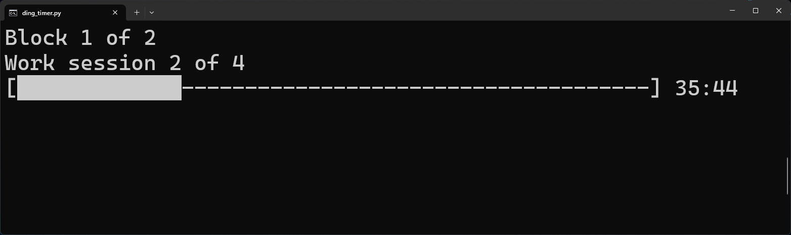

# ding_timer

## About

`ding_timer` is a lightweight, zero-dependency Pomodoro timer utility written in Python for Linux and Windows. It runs entirely in the terminal, keeps the screen clean with a static 3-line progress bar, and plays a `.wav` file when it's time to switch tasks.

- Current Version: `v0.0.2-experimental`
- Status: `Experimental` - This utility is in early development. Features may be added, removed, or broken at any time.

## Screenshot



## Usage

```bash
python3 ding_timer.py
```

Upon starting, you will be prompted to enter 6 integer values separated by spaces. If you want to use the default settings (50m work, 10m break, 4 cycles), simply press Enter.

The 6 values represent:

- `work`: Minutes per work session
- `short_break`: Minutes per short break
- `long_break`: Minutes per long break (occurs between blocks)
- `sessions`: Number of work sessions per block
- `blocks`: Total number of blocks in your workday
- `wrap_up`: Minutes for a final wrap-up session at the very end

Example custom input:

```txt
25 5 15 4 2 10
```

Pause the timer by pressing `CTRL+C`, and exit the timer by pressing `CTRL+C` again.

## Installation

`ding_timer` relies entirely on native Python and OS libraries, so there are no dependencies to install.

1. Clone the repository to your local machine:

   ```
   git clone https://github.com/daniel-meek/ding_timer.git
   ```

2. Navigate into the new directory:
   ```
   cd ding_timer
   ```

3. Run the script:
   ```
   python3 ding_timer.py
   ```

*Note: Ensure that short_break.wav and long_break.wav remain in the same directory as the Python script for the audio chimes to work correctly.*

## Changelog

### v0.0.2-experimental - 2026.04.05

- Added pausing the timer using `CTRL+C`
- Rebranded from alpha to experimental to better reflect the state of the tool

### v0.0.1-experimental - 2026.04.05

- Initial release

## Author

Made with ☕ by @daniel-meek

## Licence

This project is licensed under the **MIT License**. See the [LICENSE](LICENSE) file for the full text.
